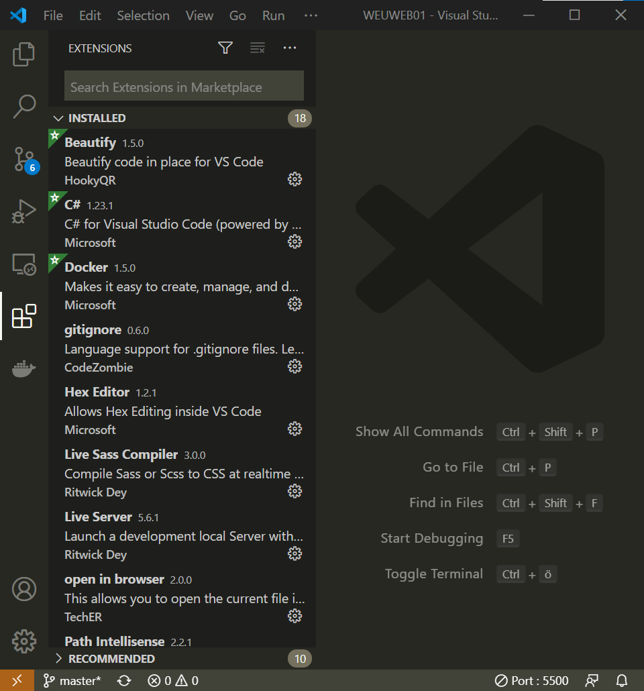

# Utvecklingsmiljö

## Installera webbeditorn VS Code & tillägg

* Installera [VS Code](https://code.visualstudio.com/)
* Installera tilläggen
  * Beautify
  * Live Server
  * Path Intellisense
  * Docker
  * PHP Intellisense
* Installera [git-scm](https://git-scm.com/)



## Installera PHP och konfigurera VS Code

1. Ladda ned [PHP 7.4 x64 Thread Safe 2](https://windows.php.net/download)
2. Packa upp till c:/php
3. Öppna VS Code
4. Fyll i rätt sökväg se [https://code.visualstudio.com/docs/languages/php](https://code.visualstudio.com/docs/languages/php)

## Skapa en utvecklingsmiljö

1. Skapa ett konto på github
2. Skapa en repository webbsrvpgm1
3. Skapa en mapp c:/github
4. Klona EE18-ar3 i VS Code inuti c:/github


## Installera Docker Desktop och LAMP-server

###  LAMP = Linux Apache Mysql PHP 

1. Installera Docker Desktop
2. Gå in i BIOS och slå på virtualisering
3. I Docker Settings aktivera Shared Folders
4. I VS Code installera tillägget Docker
5. Öppna terminalen i VS Code och kör kommandot 

* Om du använder powershell: 

```bash
docker run -d --restart unless-stopped -p 8080:80 -p 10000:10000 -v "c:\github:/var/www" -v mysql-data:/var/lib/mysql --name lamp karye/lampw 
```

* Om du använder bash: 

```bash
docker run -d --restart unless-stopped -p 8080:80 -p 10000:10000 -v /host_mnt/c/github:/var/www -v mysql-data:/var/lib/mysql --name lamp karye/lampw
```

* Instruktioner till hur du använder LAMPW finns på [https://hub.docker.com/r/karye/lampw](https://hub.docker.com/r/karye/lampw)

## Bra webblänkar

* [https://devdocs.io](https://devdocs.io)
* [http://orion.lnu.se/pub/education/course/1IK424/VT13/sessions/F01.html](http://orion.lnu.se/pub/education/course/1IK424/VT13/sessions/F01.html)
* [http://orion.lnu.se/pub/education/course/1IK424/VT13/sessions/F02.html](http://orion.lnu.se/pub/education/course/1IK424/VT13/sessions/F02.html#1)
* [http://orion.lnu.se/pub/education/course/1IK424/VT13/sessions/F03.html](http://orion.lnu.se/pub/education/course/1IK424/VT13/sessions/F03.html)

## Material


Från PHP-kompendiet av Thomas Höjemo, © SNT 2006, www.snt.se  
[http://www.snt.se/phpkompendium.pdf](http://www.snt.se/phpkompendium.pdf)  
[http://www.snt.se/phpfacit.pdf](http://www.snt.se/phpfacit.pdf)



Copyright © 2004, 2005 Rejås Datakonsult. Var och en äger rätt att kopiera, sprida och/eller förändra detta dokument under villkoren i licensen "GNU Free Documentation License", version 1.2 eller senare publicerad av Free Software Foundation, utan oföränderliga avsnitt, utan framsidestexter och utan baksidestexter. En kopia av denna licens finns på [http://rejas.se/gnu/.](http://rejas.se/gnu/.)


