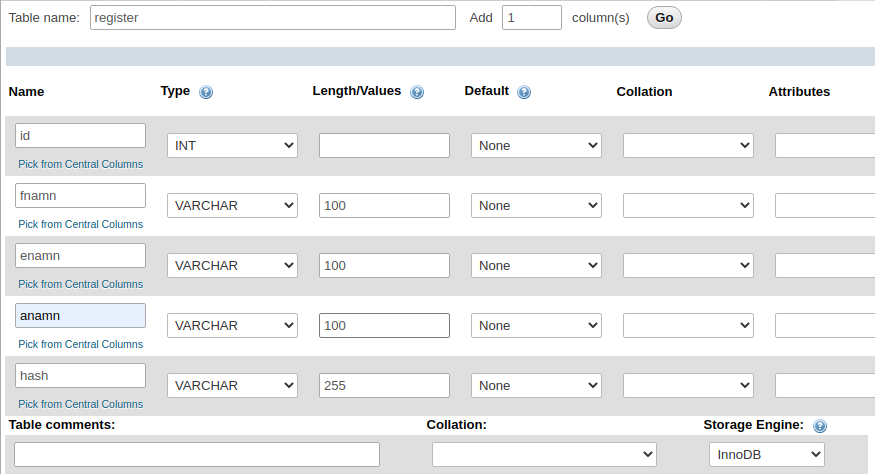

# Inloggning och sessioner

## Skapa tabell



## Skapa registrera.php

* Skapa sidan **registrera.php**



```php
<!DOCTYPE html>
<html lang="sv">
<head>
    <meta charset="utf-8">
    <meta name="viewport" content="width=device-width, initial-scale=1">
    <title>Inloggning</title>
    <link rel="stylesheet" href="https://stackpath.bootstrapcdn.com/bootstrap/4.3.1/css/bootstrap.min.css" integrity="sha384-ggOyR0iXCbMQv3Xipma34MD+dH/1fQ784/j6cY/iJTQUOhcWr7x9JvoRxT2MZw1T" crossorigin="anonymous">
    <link rel="stylesheet" href="style.css">
</head>
<body>
    <div class="kontainer">
        <header>
            <h1>Inloggning</h1>
        </header>
        <main>
            <?php
            // Ta emot data
            $fnamn = filter_input(INPUT_POST, 'fnamn', FILTER_SANITIZE_STRING);
            $enamn = filter_input(INPUT_POST, 'enamn', FILTER_SANITIZE_STRING);
            $anamn = filter_input(INPUT_POST, 'anamn', FILTER_SANITIZE_STRING);
            $losen = filter_input(INPUT_POST, 'losen', FILTER_SANITIZE_STRING);

            // Kontrollera att POST-variablerna finns, dvs första gången.
            if ($fnamn && $enamn && $anamn && $losen) {

                // Skapa sql-frågan vi skall köra
                $sql = "INSERT INTO register (fnamn, enamn, anamn) VALUES ('$fnamn', '$enamn', '$anamn')";
                $result = $conn->query($sql);

                // Gick det bra? Kunde SQL-satsen köras?
                if (!$result) {
                    die("Det blev fel med SQL-satsen.");
                } else {
                    echo "<p class=\"alert alert-success\">Användaren <strong>$anamn</strong> registrerad!</p>";
                }

                // Stänger ned anslutningen
                $conn->close();
            }
            ?>
            <form action="#" method="post">
                <label>Förnamn<input type="text" name="fnamn" required></label>
                <label>Efternamn<input type="text" name="enamn" required></label>
                <label>Användarnamn<input type="text" name="anamn" required></label>
                <label>Lösenord<input type="password" name="losen" required></label>
                <button class="btn btn-primary">Registrera</button>
            </form>
        </main>
    </div>
</body>
</html>
```



```css
@import url('https://fonts.googleapis.com/css?family=Source+Sans+Pro|Damion|Roboto+Slab&display=swap');

/* Enkel CSS-reset */
html {
    box-sizing: border-box;
}
*, *:before, *:after {
    box-sizing: inherit;
}
body, h1, h2, h3, h4, h5, h6, p, ul {
    margin: 0;
    padding: 0;
}

body {
    background: url("./bilder/georg-bommeli-ybtUqjybcjE-unsplash.jpg") top center no-repeat;
}
.kontainer {
    width: 700px;
    padding: 2em;
    margin: 1em auto;
    min-height: 89vh;
    background: #c7c7c7c7;
    border-radius: 5px;
    font-family: 'Roboto Slab', serif;
    border: 1px solid #a0a0a0;
    box-shadow: 1px 1px 4px #686868;
}
nav {
    padding: 1em 0;
}
main {
    padding: 1em;
    font-size: 0.9em;
    color: #7b7b7b;
}

form {
    background: #ffffffa3;
    border: 1px solid #a0a0a0;
    padding: 2em;
    margin-bottom: 2em;
    border-radius: 5px;
}
form label {
    color: #555555;
    font-weight: bold;
    display: grid;
    grid-template-columns: 1fr 2fr;
    margin: 10px 0;
    padding: 0;
}
form input, form textarea {
    padding: 0.5em;
    margin-top: -0.4em;
    font-style: italic;
    border-radius: 0.3em;
    border: 2px solid #55a5d2;
    box-shadow: inset 0 2px 2px rgba(0, 0, 0, 0.1);
}
form textarea {
    height: 10em;
}
form button {
    margin: 1em 0;
    padding: 0.7em;
    border-radius: 0.3em;
    border: none;
    font-weight: bold;
    color: #FFF;
    background-color: #55a5d2;
}


h1, h2, h3, h4, h5, h6 {
    font-size: 1em;
    font-weight: bold;
}
h1, h2, h3, p {
    margin: 0.8em 0;
}
h1 {
    color: #ffffff;
    font-size: 3em;
    margin: 0;
    text-shadow: 1px 1px 1px #5c5c5c;
}

table {
    width: 100%;
    border-collapse: collapse;
    border: 1px solid #b89e44;
    background: #ffffffa3;
    padding: 2em;
    border-radius: 5px;
}
th, td {
    padding: 0.5em;
    text-align: left;
}
th {
    background: #FFF;
    padding: 1em 0.5em;
}
tr:nth-child(even) {
    background: #f1f1f1;
}
/* tr:nth-child(odd) {
    background: #FFF;
} */
table .fa {
    color: #55a5d2;
}
table img {
    width: 50px;
}
form img {
    width: 30px;
}

.inlagg {
    background: #ffffffa3;
    border: 1px solid #b89e44;
    padding: 2em;
    margin-bottom: 2em;
    border-radius: 5px;
}
```



## Lista alla användare

* Skapa sidan **lista.php**

```php
<main>
    <?php
    // Skapa SQL-frågan
    $sql = "SELECT * FROM register";
    $result = $conn->query($sql);

    // Gick det bra? Kunde SQL-satsen köras?
    if (!$result) {
        die("Något blev fel med SQL-satsen.");
    } else {
        // echo "<p>Användardata kunde hämtas!</p>";
    }

    echo "<table class=\"table table-striped\">";
    echo "<tr>
        <th>Förnamn</th>
        <th>Efternamn</th>
        <th>Användarnamn</th>
        </tr>";

    // Skriv resultatet rad för rad
    while ($rad = $result->fetch_assoc()) {
        echo "<tr>";
        
        // Skriv ut förnamnet inom en cell
        echo "<td>{$rad['fnamn']}</td>";
        // Skriv ut efternamnet inom en cell
        echo "<td>{$rad['enamn']}</td>";
        // Skriv ut användarnamnet inom en cell
        echo "<td>{$rad['anamn']}</td>";
        
        echo "</tr>";
    }
    echo "</table>";

    $conn->close();
    ?>
</main>
```

## Lösenord hash

* I databasen lagras inte lösenordet utan ett hash skapat från lösenordet

```php
// Skapa ett hash från lösenordet
$hash = password_hash($losen, PASSWORD_DEFAULT);

// Skapa sql-frågan vi skall köra
$sql = "INSERT INTO register (fnamn, enamn, anamn, hash) VALUES ('$fnamn', '$enamn', '$anamn', '$hash')";
```

## Inloggning

* Skapa sidan **login.php**

```php
<main>
    <?php
    // Ta emot data
    $anamn = filter_input(INPUT_POST, 'anamn', FILTER_SANITIZE_STRING);
    $losen = filter_input(INPUT_POST, 'losen', FILTER_SANITIZE_STRING);

    // Kontrollera att POST-variablerna finns, dvs första gången.
    if ($anamn && $losen) {

        // Skapa sql-frågan vi skall köra
        $sql = "SELECT * FROM register WHERE anamn = '$anamn';";
        $result = $conn->query($sql);

        // Gick det bra? Kunde SQL-satsen köras?
        if (!$result) {
            die('Det blev fel med SQL-satsen.');
        } else {
            $rad = $result->fetch_assoc();
            
            // Kontrollera att lösenordet motsvarar hash i databasen
            if (password_verify($losen, $rad['hash'])) {
                echo "<p class=\"alert alert-success\">Du är nu inloggad!</p>";
            } else {
                echo "<p class=\"alert alert-dismissible alert-warning\">Felaktigt lösenord</p>";
            }
        }

        // Stänger ned anslutningen
        $conn->close();
    } ?>
    <form action="#" method="post">
        <label>Användarnamn
        <input type="text" name="anamn" required></label>
        <label>Lösenord
        <input type="password" name="losen" required></label>
        <button class="btn btn-primary">Logga in</button>
    </form>
</main>
```

## Infoga en meny

```php
<header>
    <h1>Inloggning</h1>
    <nav>
        <ul class="nav nav-tabs">
            <li class="nav-item">
                <a class="nav-link" href="login.php">Logga in</a>
            </li>
            <li class="nav-item">
                <a class="nav-link active" href="registrera.php">Registrera</a>
            </li>
            <li class="nav-item">
                <a class="nav-link" href="lista.php">Lista</a>
            </li>
        </ul>
    </nav>
</header>
```

## Skapa en session

### Starta sessioner

```php
<?php
/**
* PHP version 7
* @category   En enkel CRUD webbapp
* @author     ...
* @license    PHP CC
*/

include_once "./resurser/konfig-db.php";
session_start();
?>
```

### Skapa en sessionsvariabel

* Skapa en variabel **$\_SESSION\['anamn'\]**

```php
// Kontrollera att lösenordet motsvarar hash i databasen
if (password_verify($losen, $rad['hash'])) {
    $_SESSION['anamn'] = $anamn;
    echo "<p class=\"alert alert-success\">Du är nu inloggad!</p>";
} else {
    echo "<p class=\"alert alert-dismissible alert-warning\">Felaktigt lösenord</p>";
}
```

## Använda sessionen

### Enkel varning

```php
<?php
/**
* PHP version 7
* @category   En enkel CRUD webbapp
* @author     ...
* @license    PHP CC
*/

include_once "./resurser/konfig-db.php";
session_start();
?>
...
<main>
    <?php
    if (!isset($_SESSION['anamn'])) {
        echo "<p class=\"alert alert-dismissible alert-warning\">Du är inte inloggad!</p>";
    }
    ?>
</main>
...
    </div>
</body>
</html>
```

### Omdirigering

```php
<?php
/**
* PHP version 7
* @category   En enkel CRUD webbapp
* @author     ...
* @license    PHP CC
*/

include_once "./resurser/konfig-db.php";
session_start();

if (!isset($_SESSION['anamn'])) {
    header('Location: login.php');
    exit;
}
?>
```

## Utloggning

### Utöka menyn

* Menyn utöka med en ny knapp "Logga ut"

```php
<nav>
    <ul class="nav nav-tabs">
        <li class="nav-item">
            <a class="nav-link" href="login.php">Logga in</a>
        </li>
        <li class="nav-item">
            <a class="nav-link" href="logut.php">Logga ut</a>
        </li>
        <li class="nav-item">
            <a class="nav-link active" href="registrera.php">Registrera</a>
        </li>
        <li class="nav-item">
            <a class="nav-link" href="lista.php">Lista</a>
        </li>
    </ul>
</nav>
```

### Avsluta sessionen

```php
<?php
/**
* PHP version 7
* @category   En enkel CRUD webbapp
* @author     ...
* @license    PHP CC
*/

include_once "./resurser/konfig-db.php";
session_start();
?>
...
<body>
    <div class="kontainer">
        ...
        <main>
            <?php
            // Avsluta sessionen
            if (isset($_SESSION['anamn'])) {
                session_destroy();
            }
            ?>
        </main>
    </div>
</body>
</html>
```

## Förbättringar

* Slå samman knapparna **Logga in** och **Logga ut**, dvs: - Visa **Logga in** om man inte är inloggad - Visa **Logga ut** om man är inloggad
* När man är inloggad visa användarnamnet någonstans på sidan
* Dölj sidan **Registrera** när man är inloggad

## Resurser

* [https://alexwebdevelop.com/php-password-hashing](https://alexwebdevelop.com/php-password-hashing/)

