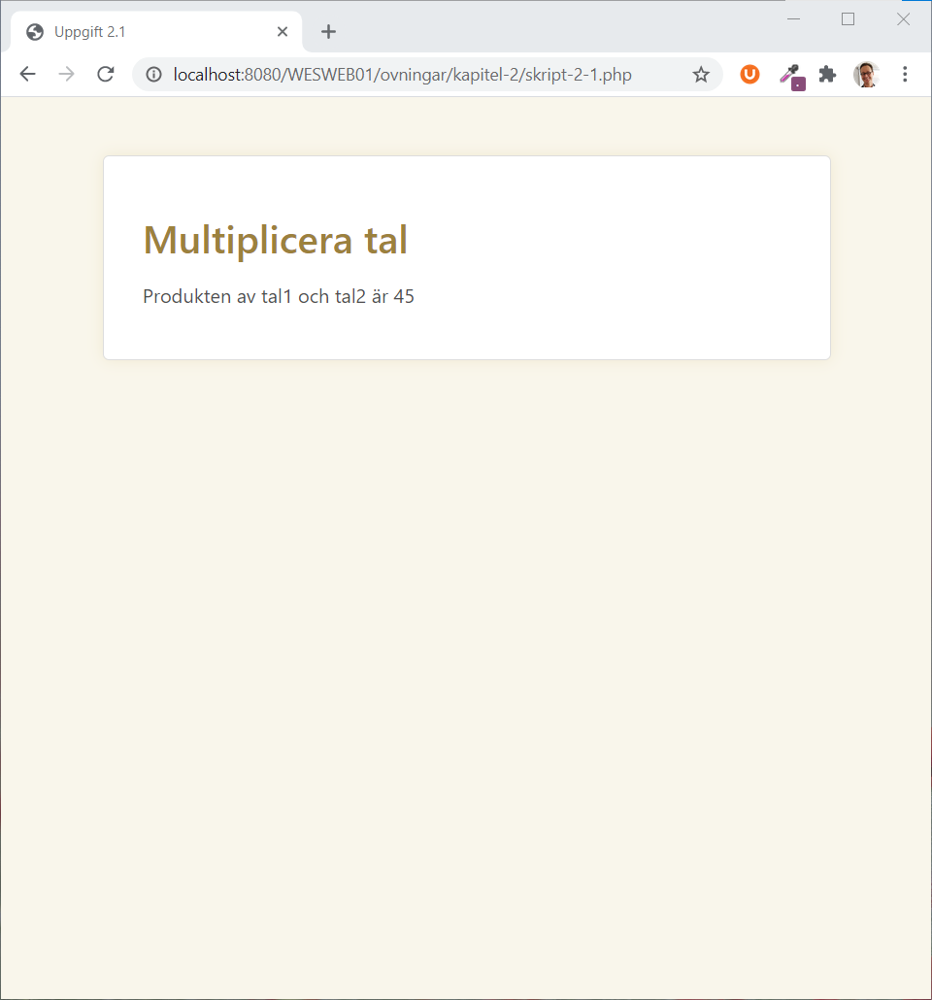
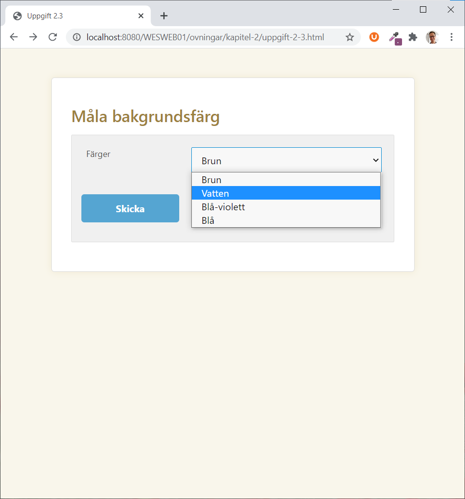
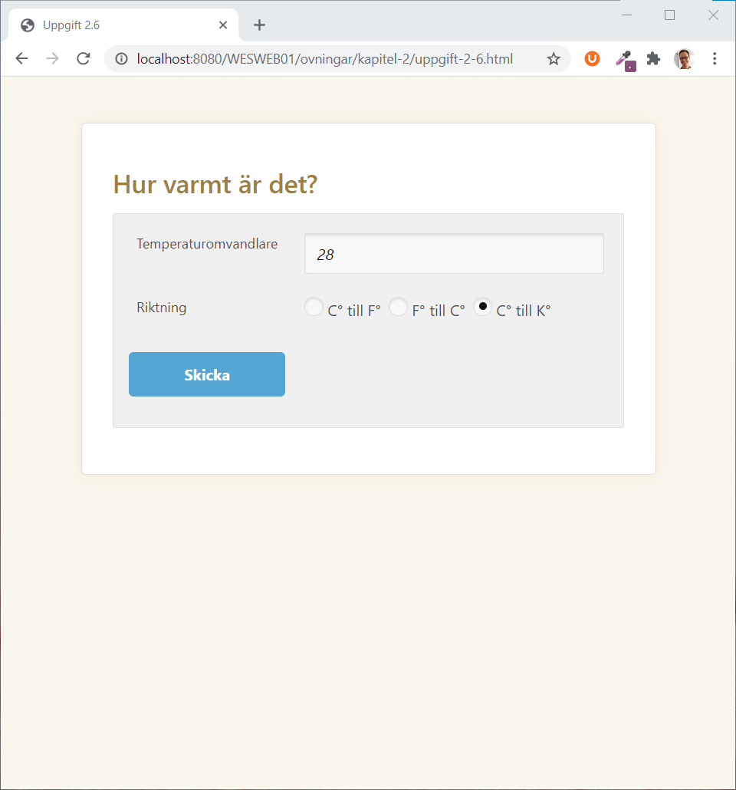

# Grunder i PHP

## **Att skriva PHP-kod**

Varje PHP-snutt börjar med **&lt;?php** och avslutas med **?&gt;**. På detta sätt kan man väva in PHP-kod i vanliga HTML-dokument.

```php
<!DOCTYPE html>
<html lang="sv">
    <head>
        <meta charset="utf-8">
        <title>Dagens datum</title>
        <link rel="stylesheet" href="">
    </head>
    <body>
        
    </body>
</html>
```

Detta är ett helt vanligt HTML-dokument. Om vi tittar på det i en webbläsare kommer vi att få upp ett tomt dokument med titeln "Dagens datum". Nu kan vi väva in PHP-kod i dokumentet.

```php
<!DOCTYPE html>
<html lang="sv">
    <head>
        <meta charset="utf-8">
        <title>Dagens datum</title>
        <link rel="stylesheet" href="">
    </head>
    <body>
    <?php
    echo date("Y-m-d H:i");
    ?>
    </body>
</html>
```

Då får vi alltså automatiskt uträknat dagens datum för oss. Man kan även börja PHP-kod med endast **&lt;?**, det är en smaksak vilket man väljer. [echo](https://devdocs.io/php/function.echo) i koden betyder att vi ska skriva ut någonting på skärmen. Sedan använder vi [date\(\)](https://devdocs.io/php/function.date) för att få dagens datum. **Y** talar om att vi vill ha årtalet \(**Year**\), **m** betyder **månad** och **d** dag i månaden. **H** står för **hour** vilket ger oss timslaget och i ger oss minuterna. Ett litet enklare exempel kan se ut så här:

```php
<!DOCTYPE html>
<html lang="sv">
    <head>
        <meta charset="utf-8">
        <title>Dagens datum</title>
        <link rel="stylesheet" href="">
    </head>
    <body>
    <?php
    echo "Hej världen!";
    ?>
    </body>
</html>
```

Detta skriver ut raden "Hej världen!" på skärmen. Så fort man ska skriva ut någonting så måste det inneslutas i citationstecken, också kallade dubbelfnuttar. Observera också att varje rad avslutas med ett semikolon. Man kan välja att skriva ut HTML-kod inuti [echo](https://devdocs.io/php/function.echo)-satsen också:

```php
<?php
echo "<h1>Hej världen</h1>";
?>
```

Nu kommer texten som skrivs ut på skärmen att vara en rubrik. Vi skulle kunna skriva in **h1**-taggen som gör texten till fetstil i själva HTML-koden i stället.

```php
<!DOCTYPE html>
<html lang="sv">
    <head>
        <meta charset="utf-8">
        <title>Dagens datum</title>
        <link rel="stylesheet" href="">
    </head>
    <body>
        <h1>
        <?php
        echo "Hej världen!";
        ?>
        </h1>
    </body>
</html>
```

Vilket ger samma resultat.

## **Variabler**


En variabel är en behållare för ett värde. Tänk dig den som en kökslåda som innehåller någonting. Vi har ett namn på kökslådan dvs. själva variabeln och sedan har variabeln ett innehåll. Det finns två huvudtyper av variabler: strängar och tal. Strängar innehåller text medan tal innehåller siffror. Innan man använder en variabel behöver den tilldelas ett värde. \(jag har här uteslutit HTML-koden runt skriptet för att vi ska koncentrera oss på det viktiga\).

```php
<?php
$namn = "Thomas Höjemo";
?>
```

Nu har variabeln **$namn** fått värdet "Thomas Höjemo". Observera att alla variabler alltid börjar med dollartecknet. Lika med tecknet talar om att variabeln ska få ett värde. När man ger en variabel ett strängvärde, vilket vi gör i detta fall, måste strängen vara omgiven av dubbelfnuttar. I annat fall kommer vi att få ett felmeddelande:

```php
<?php
$namn = Thomas Höjemo;
?>
```

**Parse error** betyder att PHP helt enkelt inte förstod vad vi menade. Man brukar använda variabelnamn som har små bokstäver. Det är också viktigt att använda variabelnamn som gör det enkelt att förstå vad variabeln ska användas till, så det är bättre att kalla en variabel för t.ex. **$efternamn** än **$var45**. Variabelnamnet får innehålla bokstäver, siffror samt understreck \(\_\) men kan ej börja med en siffra. Så hur använder man då variabler? Ofta vill man skriva ut variabelinnehållet på skärmen mixat med färdig text runt, och då gör man på följande sätt:

```php
<?php
$namn = "Thomas Höjemo";
echo "$namn";
?>
```

I detta fall kommer alltså variabelinnehållet att skrivas ut i stället för **$namn**. Observera att detta endast gäller om dubbla citationstecken används. Vi kan se vad som händer om vi har enkla citationstecken \(enkelfnuttar\) i stället:

```php
<?php
$namn = "Thomas Höjemo";
echo '$namn';
?>
```

Som ni ser skrivs **$namn** ordagrannt ut. Det är alltså viktigt att alltid använda dubbelfnuttar när man ska skriva ut variabler. Men det är ju tur att enkelfnuttar finns också, annars skulle det vara svårt att skriva ut dollartecken! Genom att använda punkttecknet kan man kombinera vanlig text och strängvariabler:

```php
<?php
$namn = "Thomas Höjemo";
echo "Mitt namn är " . $namn . " och jag bor i Göteborg.";
?>
```

Vi kan även baka in variabeln mellan citationstecknen, men observera att detta endast går då det är mellanrum före och efter variabelnamnet:

```php
<?php
$namn = "Thomas Höjemo";
echo "Mitt namn är $namn och jag bor i Göteborg.";
?>
```

För att använda tal i variabler så fungerar det på i stort sett samma sätt. Det är dock viktigt att komma ihåg att man aldrig ska ha några fnuttar runt talen. Observera också att man använder decimalpunkt, ej decimalkomma.

Ett exempel:

```php
<?php
$tal1 = 37.76;
$tal2 = 45.23;
$summa = $tal1 + $tal2;
echo "Summan av $tal1 och $tal2 är $summa";
?>
```

Man kan använda **+ - \*** och **/** för att räkna med tal. Dessa kallas med ett finare uttryck för aritmetiska operatorer. Det finns också något som kallas logiska operatorer men de kommer vi att gå igenom senare.

### **Datatyper**

PHP är ett löst typat språk. Detta innebär att man inte behöver deklarera vad för typ av variabel man vill ha innan man skapar den.

Det finns åtta olika typer av datatyper:

| Datatyp | Beskrivning | Förklaring |
| :--- | :--- | :--- |
| Boolean | 1 eller o | sant eller falskt |
| Integer | heltal | positiva eller negativa heltal |
| Float | decimaltal | positiva eller negativa decimaltal |
| String | sträng | kan innehålla både bokstäver och siffror |
| Objekt | objekt | används vid objektorienterad programmering |
| Array | matris | innehåller flera variabler som var och en kan ha olika datatyp |
| Resource | resurs | en pekare till en extern resurs, t.ex. en databas |
| Null | ingenting | en variabel som ej har satts till något värde har värdet **Null** |

#### **Typkonvertering**

PHP omvandlar tyst mellan olika variabeltyper:

```php
<?php
$tal1 = "7 kr";
$tal2 = "3 kr";
$summa = $tal1 + $tal2;
echo "Summan är $summa";
?>
```

I detta program sker typkonverteringen på raden där **$tal1** och **$tal2** adderas. Eftersom addition av förståeliga skäl är svårt att utföra med strängar, omvandlas variablerna **$tal1** och **$tal2** från strängar till tal. Slutresultatet blir att "Summan är 10" skrivs ut.

Det går även att explicit konvertera mellan olika typer. Detta görs genom att skriva typen man vill konvertera till enligt följande:

```php
<?php
$antal = 100.32;
$antal = (int) $antal;     // $antal innehåller heltalet 100
$antal = (double) $antal;  // $antal innehåller decimaltalet 100 (100.0)
$antal = (string) $antal;  // $antal innehåller strängen 100
?>
```

Detta kan bland annat vara användbart för att säkerställa att formulärdata verkligen är av rätt typ.

#### **Kontrollera variabeltyp**

Genom funktionen [gettype**\(\)**](https://devdocs.io/php/function.gettype) kan man kontrollera vilken variabeltyp en viss variabel har.

```php
<?php
$variabel = "Hej";
echo gettype($variabel);   // Ger resultatet string
?>
```

För att undersöka om en variabel är av en viss typ används serien funktioner som börjar på is\_. T.ex. [is\_int\(\)](https://devdocs.io/php/function.is-int), [is\_string\(\)](https://devdocs.io/php/function.is-string), [is\_double\(\)](https://devdocs.io/php/function.is-double).

```php
<?php
$variabel = "Hej";
if (is_string($variabel)) {
    echo "Det var en sträng!";
} else {
    echo "Det var inte en sträng!";
}
?>
```

### **Fördefinierade variabler**

PHP har en stor mängd fördefinierade variabler. Det vanligaste användningsområdet för dessa är för att se vilken information som skickats från ett formulär. När ett formulär skickats iväg till ett PHP-skript så lagras automatiskt formulärelementens innehåll i arrayen [$\_REQUEST](https://devdocs.io/php/reserved.variables.request), [$\_POST](https://devdocs.io/php/reserved.variables.post) eller [$\_GET](https://devdocs.io/php/reserved.variables.get). Mer information om matriser kommer senare i kursen.

Har vi tex skapat en textruta med namnet "adress" och användaren fyller i värdet "Karlsgatan 12" så kommer **$\_REQUEST\['adress'\]** få innehållet "Karlsgatan 12". Fyller användaren i stället i textrutan "telefon" med numret "012-345678" får **$\_REQUEST\['telefon'\]** innehållet "012-345678". För att skriva ut telefonnumret behövs endast [echo](https://devdocs.io/php/function.echo) enligt följande modell:

```php
echo $_REQUEST['telefon'];
```

Vilket kommer att resultera i att "012-345678" skrivs ut på skärmen förutsatt att användaren matade in just det numret i formuläret.

I det fall en inställning ändrats i PHP-systemkonfigurationen så kommer även fristående variabler skapas. I exemplen ovan skulle i så fall variablerna **$adress** och **$telefon** skapas. Denna inställning är avstängd från början, eftersom det kan medföra säkerhetsrisker om den används på ett slarvigt sätt.

**$\_SERVER\['HTTP\_REFERER'\]** innehåller den sida som besökaren kom ifrån till skriptet. \(Notera att refererer skrivs med ett r, vilket beror på en pinsam felstavning i http-protokollet.\) **$\_SERVER\['REMOTE\_ADDR'\]** innehåller IP-adressen som besökaren har. **$\_SERVER\['PHP\_SELF'\]** innehåller den kompletta adressen till skriptet som körs. För mer information om alla fördefinierade variabler, se [PHP-manualen](http://www.php.net/manual).

## **Kommentarer**

Genom att lägga in kommentarer i sitt skript kan man skriva vad ett speciellt avsnitt gör. Har man långa komplicerade skript kan detta vara bra, eftersom det annars kan vara svårt att förstå vad varje del är till för. Det finns två olika sätt att skriva kommentarer i PHP. Det första sättet ser ut så här:

```php
<!DOCTYPE html>
<html lang="sv">
    <head>
        <meta charset="utf-8">
        <title>Dagens datum</title>
        <link rel="stylesheet" href="">
    </head>
    <body>
    <?php 
    echo "Hej världen!";     // Skriver ut raden Hello World på skärmen
    ?>
    </body>
</html>
```

// är avsett för kommentarer som sträcker sig över endast en rad. Med den andra typen av kommentarer kan man ha flera rader:

```php
<!DOCTYPE html>
<html lang="sv">
    <head>
        <meta charset="utf-8">
        <title>Dagens datum</title>
        <link rel="stylesheet" href="">
    </head>
    <body>
    <?php 
    /* Skript skrivet av
    Thomas Höjemo
    år 2006.
    */
    echo "Hej världen!";
    ?>
    </body>
</html>
```

Man börjar alltså kommentaren med **/\*** och avslutar med **\*/**.

## Uppgifter - variabler och kommentarer

### **Uppgift 1**

Använd formuläret från uppgift 1.1. Skapa ett PHP-skript som tar emot de två talen, multiplicerar dem och presenterar resultatet så här: **"Produkten av tal1 och tal2 är ..."**.



### **Uppgift 2**

Använd formuläret från uppgift 1.2. Skapa ett skript som tar emot data från detta formulär: Skriptet ska skriva ut **"Namn:"** följt av namnet på personen, **"epostadress:"** och personens epostadress och till sist **"Vi kommer att kontakta dig inom snarast per "** följt av antingen **epost** eller **telefon** beroende på vad användaren valt.


### **Uppgift 3**

Gör ett formulär där användaren kan välja bland fyra färger att "måla" bakgrunden med för webbsidan som kommer upp när han/hon klickat på knappen **Måla bakgrund**. Skapa sedan ett skript som verkligen gör detta. Färgerna ska vara **röd**, **blå**, **grön** och **gul**.

Tips: färgerna skrivs med sina engelska namn enligt följande exempel \(som visar en sida med svart bakgrund\):

```php
<!DOCTYPE html>
<html lang="sv">
    <head>
        <meta charset="utf-8">
        <title>Bakgrundsfärg</title>
    </head>
    <body style="background: black;">
    </body>
</html>
```



### **Uppgift 4**

Skriv ett skript som tar en siffra \(från formuläret i uppgift 1.4\) som innehåller dagens temperatur i Celsius. Programmet ska sedan skriva ut hur många grader Fahrenheit det motsvarar enligt följande mall: "**100 grader Celsius motsvarar 212 grader Fahrenheit**". Formeln för omvandlingen är **F = \(9/5\)\*C + 32** där F står för grader Fahrenheit och C för grader Celsius.


### **Uppgift 5**

Ändra föregående formulär så att man kan med radioknappar välja mellan "**Omvandla från F° till C°**" eller "**Omvandla C° till F°**". Ändra på skriptet så att uträkningen stämmer.


### **Uppgift 6**

Utöka föregående formulär så att man kan också välja "**Omvandla C° till K°**". K står för temperatur i Kelvin enligt formeln **K = C - 273**. Ändra på skriptet så att uträkningen stämmer.



### **Uppgift 7**

Skapa ett formulär som tar emot en text och där man kan välja mellan att konvertera till **versaler** \(stora bokstäver\) eller till **gemener** \(små bokstäver\). Läs om funktioner på [strtoupper\(\)](http://php.net/manual/en/function.strtoupper.php) och [strtolower\(\)](http://php.net/manual/en/function.strtolower.php).

### **Uppgift 8**

Försök att lista ut vad följande program kommer att skriva ut.

```php
<?php
$ett = '$noll';
echo "$ett";
echo '$ett';
?>
```

Prova sedan att mata in koden och se om du gissade rätt.

#### **Fler övningar**

* [https://mi.sh.se/labwiki2/index.php/1126ME\_WProg1](https://mi.sh.se/labwiki2/index.php/1126ME_WProg1)


Från PHP-kompendiet av Thomas Höjemo, © SNT 2006, www.snt.se


