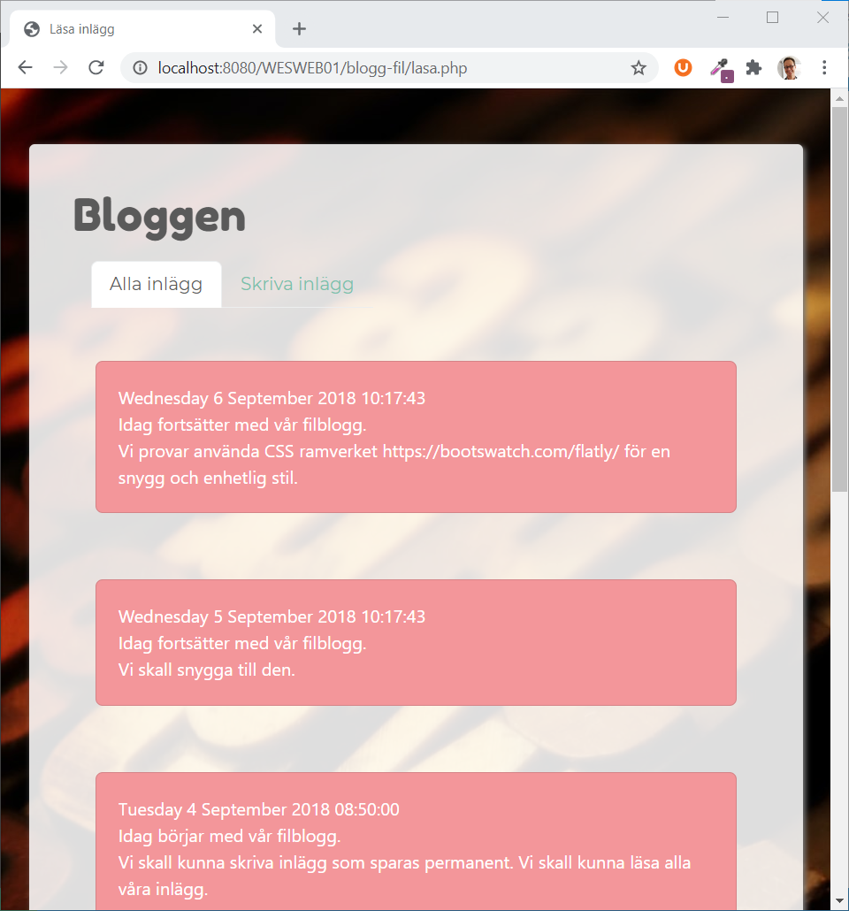

# Labb 4: blogg

## **Resultat**



## **Syfte**

* Träna på att läsa in filer 
* Träna på att array och loopar
* Träna på felhantering

## **Startkod**



```markup
<!DOCTYPE html>
<html lang="sv">
<head>
    <meta charset="utf-8">
    <meta name="viewport" content="width=device-width, initial-scale=1">
    <title>Min enkla blogg</title>
    <link rel="stylesheet" href="https://cdnjs.cloudflare.com/ajax/libs/bootswatch/4.3.1/minty/bootstrap.min.css">
    <link rel="stylesheet" href="./style.css">
</head>
<body>
    <div class="kontainer">
        <header>
            <h1>Bloggen</h1>
            <nav class="navbar navbar-expand-lg navbar-light">
                <ul class="nav nav-tabs">
                    <li class="nav-item"><a class="nav-link" href="blogg.php">Alla inlägg</a></li>
                    <li class="nav-item"><a class="active nav-link" href="spara.php">Skriva inlägg</a></li>
                </ul>
            </nav>
        </header>
        <main>
            ...
        </main>
        <footer>
            2020
        </footer>
    </div>
</body>
</html>
```



```css
@import url('https://fonts.googleapis.com/css?family=Fredoka+One&display=swap');

body {
    background: rgb(255, 255, 255) url("../bilder/bg.jpg");
    background-size: cover;
    background-attachment: fixed;
}

.kontainer {
    background: #FFF;
    width: 800px;
    margin: 50px auto;
    padding: 40px;
    border-radius: 10px;
    box-shadow: 2px 2px 5px;
}
header {
    margin-bottom: 40px;
}
h1 {
    font-family: 'Fredoka One', cursive;
}
nav {
    margin: 10px 0;
}
main p {
    background: #ffffff;
    padding: 20px;
    border-radius: 5px;
    margin: 20px;
}
main form {
    margin: 20px;
}
main button {
    margin: 10px 0;
}

```



## **Skriva inlägg**

### **Skriva inlägget : spara.php**

* Ett formulär behövs för att skriva in ett inlägg

```markup
...
<main>
    <form action="#" method="post">
        <textarea class="form-control" name="inlagg" id="inlagg" cols="30" rows="10"></textarea>
        <button class="btn btn-primary">Spara inlägg</button>
    </form>
...
```

### **Skriva till en textfil - spara.php**

* PHP-skriptet i **spara.php** tar emot data och skall lagra inlägget i en textfil
* Ersätt '...' med rätt PHP-syntax
* Studera
  * Funktionen [isset\(\)](https://devdocs.io/php/function.isset) - se om variabeln finns
  * Funktionen [fopen\(\)](https://devdocs.io/php/function.fopen) - öppna en fil
  * Funktionen [fwrite\(\)](https://devdocs.io/php/function.fwrite) - skriva till en fil

```php
...
<?php
// Ta emot text från formuläret och spara ned i en textfil.
if (...($_POST['inlagg'])) {
    
    // Läs in texten
    $texten = $_POST["inlagg"];
    
    // Vad heter textfilen?
    $filnamn = "blogg.txt";
    
    // Vad är dagens datum?
    $tidpunkt = date("...");

    // Öppna anslutningen till textfilen
    $handtag = ...($filnamn, "a");

    // Skriv datum & text i textfilen
    ...

    // Stäng anslutningen till textfilen
    ...

    // Skriv ut bekräftelse
    echo "...";
} else {
    // Skriv felmeddelande
    echo "...";
}
?>
...
```

### Omvandla radbrytningar

* Alla radbrytningar i texten man matar måste ersättas med &lt;br&gt; 

## **Läsa inläggen**

### **Läsa från en textfil - blogg.php**

* Här läses alla inlägg in från textfilen
* Ersätt '...' med rätt PHP-syntax
* Studera:
  * Funktionen [file](https://devdocs.io/php/function.file) - läsa in hela filen

```php
    ...
    <?php
    $filnamn = "blogg.txt";

    // Öppna asnslutningen till textfilen
    $innehall = ...(...);

    // Läs rad för rad i textfilen
    ... ($innehall as $rad) {
        echo "$rad";
    }

    // Stäng anslutningen till textfilen
    ...(...);
    ?>
    ...
```

### **Visa senaste inläggen överst**

* De inlästa inläggen måste visas i omvänd ordning
* Studera:
  * Funktionen [array\_reverse](https://devdocs.io/php/function.array-reverse)

## Säkerhet

### Skydda mot HTML-taggar

* Översätt alla eventuella HTML-taggar till HTML entities
* Studera funktionen [htmlentities\(\)](https://devdocs.io/php/function.htmlentities)

### **Kontrollera att filen är skrivbar**

* För att webbappen inte skall krascha behöver vi kontrollera en del saker
* Studera koden nedan
* Studera också 
  * Funktionen [is\_writable\(\)](https://devdocs.io/php/function.is-writable) - se om filen är skrivbar
* Ersätt '...' med rätt text
* Infoga kontrollerna \(if-satser\) i **spara.php**

