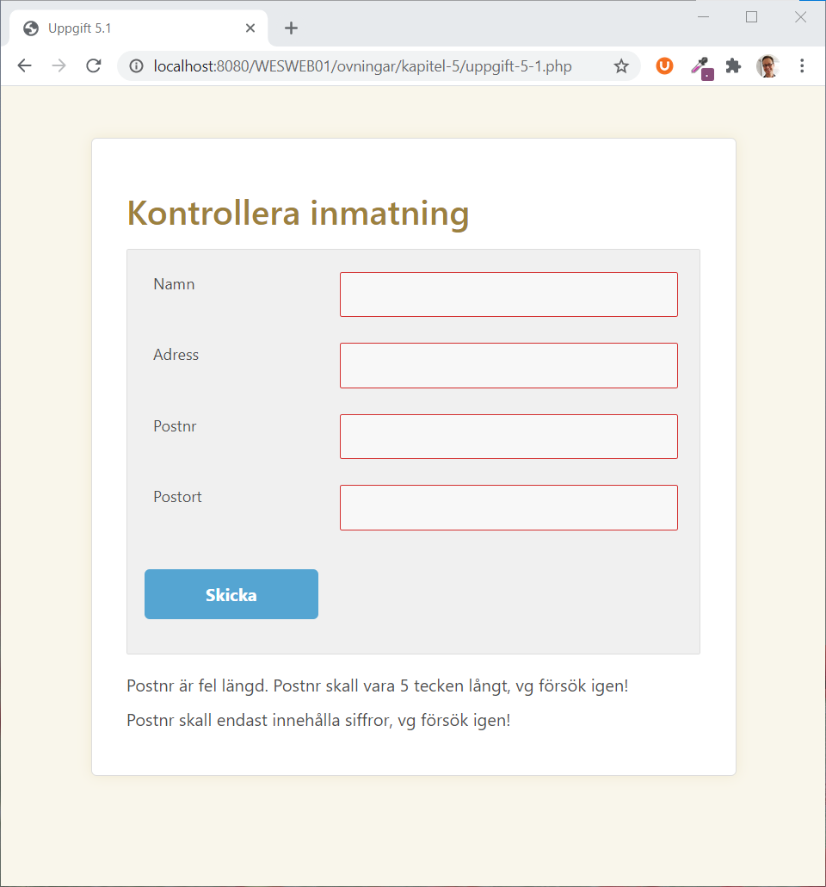
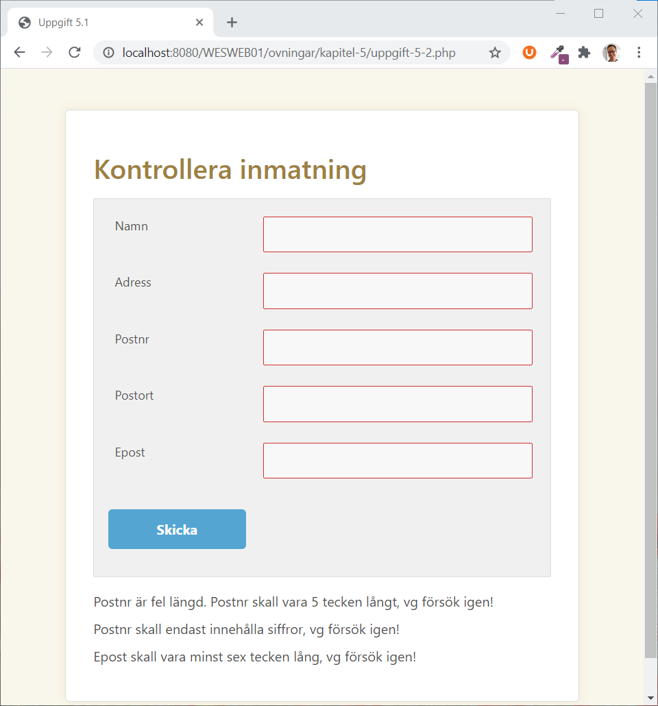
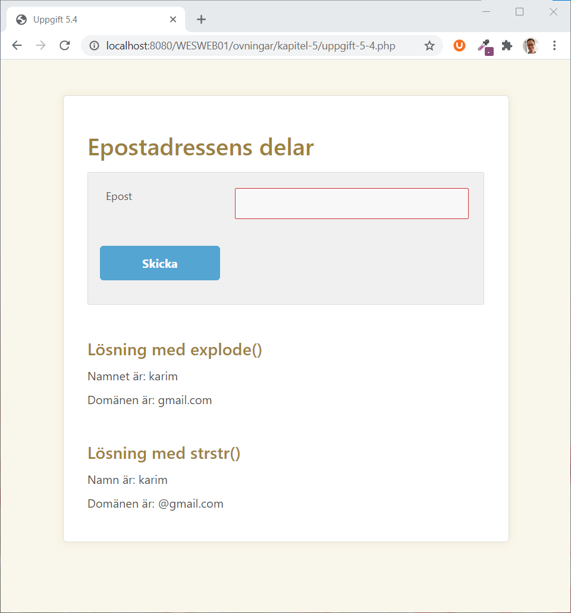
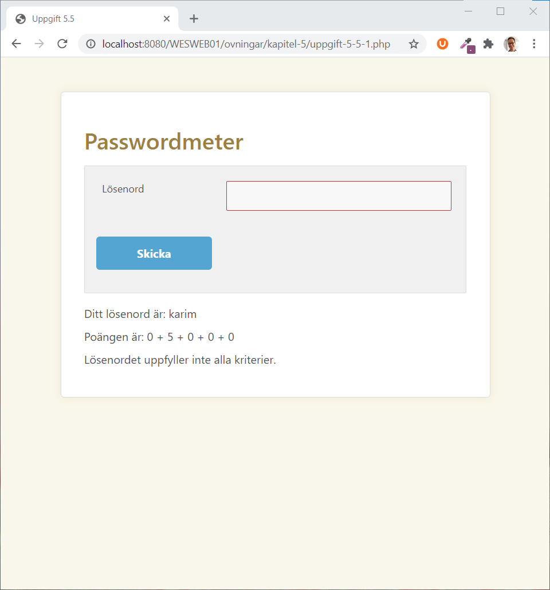

# Arbeta med text

## Stränghantering

Stränghantering används ofta i samband med inmatning för användare. Ibland för att kontrollera så att en epost-adress är korrekt utformad, och ofta dessutom av säkerhetsskäl.

### **trim\(\): ta bort mellanrum i början och slutet**

Ibland kan användare av misstag råkat skriva extra mellanrum efter inmatningar av tex. adress eller telefonnummer. När man sedan sparar data i tex. en databas, vill man inte ha med mellanrummen. Därför använder man funktionen [trim\(\)](https://devdocs.io/php/function.trim) för att ta bort dem. Observera att detta enbart gäller mellanrum precis i början eller slutet av en sträng; aldrig mitt i. Funktionen tar förutom mellanslag även bort nyradtecken och tabtecken. Om vi tex. har en variabel med namnet **$adress** kan vi göra så här:

```php
$adress = trim($adress);
```

### **strtolower\(\)/strtoupper\(\): omvandla till små eller stora bokstäver**

När man ska jämföra strängar tar PHP som standard hänsyn till små och stora bokstäver. Om $inmatat har värdet "Test" och **$kontroll** värdet "test" så kommer en jämförelse mellan dem med hjälp av == ej vara sann. Men om man då inte vill ta hänsyn till små och stora bokstäver? Då kan man använda [strtolower\(\)](https://devdocs.io/php/function.strtolower) eller [strtoupper\(\)](https://devdocs.io/php/function.strtoupper). Om vi tar exemplet med jämförelsen av **$a** och **$b**:

```php
$kontroll = "test";
if (strtolower($inmatat) == $kontroll) {
    // gör något...
} else {
    // gör något annat...
}
```

Observera att **$inmatat** fortfarande har värdet "Test". Vill vi förändra detta gör vi så här:

```php
$inmatat = strtolower($inmatat);
```

Funktionen [strtoupper\(\)](https://devdocs.io/php/function.strtoupper) fungerar på samma sätt, med skillnaden att alla bokstäver blir versaler.

### **strlen\(\): längden på en sträng**

Med [strlen\(\)](https://devdocs.io/php/function.strlen) \(står för string length\) får vi reda på antalet tecken i en sträng.

```php
$text = "Hej och hopp";
echo strlen($text); // Skriver ut 12
```

### **substr\(\): plocka ut delar av en sträng**

Följande exempel tar ut de tre första tecknen ur strängen **$text**:

```php
$text = "Hej och hopp";
$start = substr($text, 0, 3); // Plockar ut "Hej";
```

Observera att det första tecknet har position **0**! Först specificerar vi namnet på variabeln, sedan positionen och sist längden på den delsträng vi vill ha ut. Det går även att ta delsträngar från slutet:

```php
$text = "Hej och hopp";
$slut = substr($text, -4);// Plockar ut "hopp";
```

Här får vi alltså ut de sista fyra tecknen i strängen. Se [substr\(\)](https://devdocs.io/php/function.substr).

### **strstr\(\): söka igenom en sträng**

Ibland vill man ta reda på om en viss text finns inuti en sträng. Detta gör man med [strstr\(\)](https://devdocs.io/php/function.strstr):

```php
$namn = "Ulrika Eriksson";
$efternamn = strstr($namn, " ");
```

Här söker vi efter strängen **" "** det vill säga ett mellanslag. Eftersom vi hittar ett mellanslag i strängen **$namn**, kommer nu resten av strängen efter mellanslaget returneras.

Det går även att använda [strstr\(\)](https://devdocs.io/php/function.strstr) i en **if**-sats för att köra olika kod beroende på om strängen hittades eller inte:

```php
$namn = "Ulrika Eriksson";
if (strstr($namn, " ")) {
    echo "Variabeln $namn innehåller mellanslag";
} else {
    echo "Variabeln $namn innehåller inte mellanslag";
}
```

```text
Note:
If you only want to determine if a particular needle occurs within haystack, use the faster and less memory intensive function strpos() instead.
```

### **str\_replace\(\): söka och ersätta**

Funktionen [str\_replace\(\)](https://devdocs.io/php/function.str-replace) används för att söka efter en delsträng och ersätta den med något annat.

```php
$ny_variabel = str_replace("vit", "svart", "vit katt på taket");
echo $ny_variabel;
```

I detta fall kommer texten "svart katt på taket" skrivas ut.

## Uppgifter - stränghantering

### **Uppgift 1**

Gör ett **formulär** där användaren ska fylla i **namn, adress, postnr och postort**.

* Kontrollera att alla fälten är ifyllda, och innehåller minst 3 tecken.
* Kontrollera att postnumret innehåller 5 tecken och att de tecknen endast är siffror.



### **Uppgift 2**

Bygg på formuläret så att användaren också ska fylla i en **epostadress**.

* Kontrollera sedan att epostadressen innehåller ett @, och minst en punkt.
* Kontrollera också att epostadressen är minst sex tecken lång.



### **Uppgift 3**

Utveckla skriptet i uppgift 6.2 så att det tar bort mellanslag i **postnumret** och därmed tillåter postnummer inskrivna enligt formen "415 22".

### **Uppgift 4**

Skapa en webbapp där användaren matar in en epostadress och får ut **namn** och **domänet** som svar.



### **Uppgift 5**

Skapa en webbapplikation som testar styrkan på ett **lösenord**. Se [passwordmeter.com](http://www.passwordmeter.com/).



## Extra uppgifter

### Uppgift 6

Skapa ett skript där användaren får skriva in en mening \(utan punkt\) som består av två ord.   
Skriv ut orden till användaren i omvänd ordning.

### Uppgift 7

Skapa ett skript där användaren på endast en rad ska skriva in en addition av två heltal som ska utföras . Användaren ska inte skriva några mellanslag, tex. kan man skriva 4+3 eller 10+27.   
Beräkna svaret och skriv ut det.

### Uppgift 8

Skapa ett skript där användaren ska skriva in en mening med tre ord, meningen ska avslutas med en punkt.   
Skriv ut orden till användaren i omvänd ordning, det ska vara en punkt i slutet.

