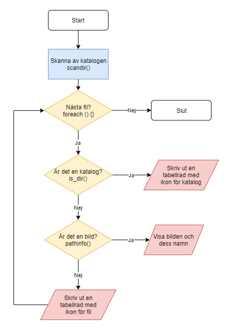

# Skanna kataloger

## Skanna innehållet av en katalog

### scandir\(\)

* Med funktionen [scandir\(\)](https://devdocs.io/php/function.scandir) skannar man av innehållet i en katalog.
* Resultat blir en array.



```php
<!DOCTYPE html>
<html lang="sv">
<head>
    <meta charset="utf-8">
    <meta name="viewport" content="width=device-width, initial-scale=1">
    <title>Skanna katalog</title>
    <link rel="stylesheet" href="style.css">
</head>
<body>
    <div class="kontainer">
        <h1>Lista alla filer och kataloger</h1>
        <?php
        $katalog = ".";

        // Skanna av katalogen
        $resultat = scandir($katalog);

        var_dump($resultat);
        ?>
    </div>
</body>
</html>
```



```
@import url('https://fonts.googleapis.com/css2?family=Open+Sans&display=swap');

/* Enkel CSS-reset */
html {
    box-sizing: border-box;
}
*, *:before, *:after {
    box-sizing: inherit;
}
body, h1, h2, h3, h4, h5, h6, p, ul {
    margin: 0;
    padding: 0;
}

body {
    background: #F9F6EB;
}
.kontainer {
    width: 600px;
    padding: 2em;
    margin: 3em auto;
    background: #fff;
    border-radius: 5px;
    font-family: 'Open Sans', sans-serif;
    border: 1px solid #ddd;
    box-shadow: 0 0 12px #f0e9d1;
    color: #4e4e4e;
}

h1, h2, h3 {
    color: #9c813d;
}
h1, h2, h3, p {
    margin: 0.5em 0;
}
h3 {
    margin-top: 2em;
}

form {
    margin: 1em 0;
    padding: 1em;
    font-size: 0.9em;
    color: #4e4e4e;
    background: #E6F2F8;
    border-radius: 0.3em;
}
form label {
    display: grid;
    grid-template-columns: 1fr 2fr;
    margin: 10px 0;
    padding: 0;
}
form input, form textarea {
    padding: 0.5em;
    margin-top: -0.4em;
    font-style: italic;
    border-radius: 0.3em;
    border: 2px solid #55a5d2;
    box-shadow: inset 0 2px 2px rgba(0, 0, 0, 0.1);
}
form textarea {
    height: 10em;
}
form button {
    margin: 1em 0;
    padding: 0.7em;
    border-radius: 0.3em;
    border: none;
    font-weight: bold;
    color: #FFF;
    background-color: #55a5d2;
}

table {
    width: 100%;
    border-collapse: collapse;
    margin: 2em 0;
}
table th, table td {
    padding: 0.5em;
    text-align: left;
}
table th {
    background: #305A85;
    color: #FFF;
}
table tr:nth-child(even) {
    background: #E6F2F8;
}
table tr:nth-child(odd) {
    background: #FFF;
}
table .fa {
    color: #55a5d2;
}
```



## Flödeschema



### Skriv ut lista

* Eftersom resultatet är en array använder man foreach-loopen för att skriva ut innehållet.

```php
// Skriv ut allt vi hittat
foreach ($resultat as $objekt) {
    echo "<p>$objekt</p>";
}
```

### Osynliga filer och kataloger

* Alla filer kommer med i skanningen. 
* Det första man inte vill få med är "." och "..".

```php
// Ta inte med . och ..
if ($objekt != '.'  && $objekt != '..') {

}
```

## Info om filer och kataloger

### [is\_dir\(\)](https://devdocs.io/php/function.is-dir)

* Är vad objekt en katalog? True eller false.

```php
// Är det en katalog?
if (is_dir("$katalog/$objekt")) {
    echo "<p>Katalog: $objekt</p>";
}
```

### [pathinfo\(\)](https://devdocs.io/php/function.pathinfo)

* Hur får man mer info om objekten?
  * 'dirname'
  * 'basename'
  * 'extension'
  * 'filename'

```php
$filInfo = pathinfo($objekt);
$filtyp = $filInfo['extension'];
echo "<p>Filtypen är $filtyp</p>";
```

