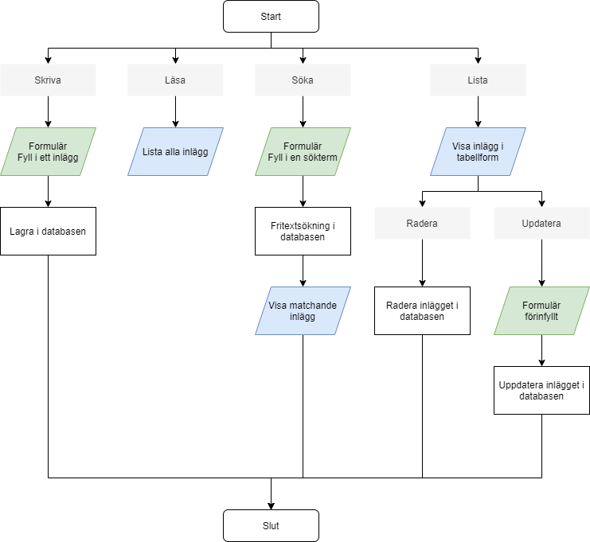

# Labb 9 - blogg med databas

## Resultatet


## Funktioner i en webbapplikation



### CRUD

* I en webbapplikation pratar om sk CRUD.
* Det betyder hur man hanterar informationen som lagras i webbappen
* Man skall kunna göra följande operationer:
  * Spara information, tex användare, inlägg osv
  * Läsa/söka efter det som lagrats i databasen
  * Kunna redigera det som lagrats
  * Kunna ta bort från databasen det man inte vill behålla


### **Steg 1 - skapa först tabellen i databasen**

* Skapa en ny tabell **blogg** i phpmyadmin:

```sql
CREATE TABLE IF NOT EXISTS blogg (
  id INT NOT NULL AUTO_INCREMENT PRIMARY KEY,
  rubrik VARCHAR(255) NOT NULL,
  inlagg TEXT NOT NULL,
  datum TIMESTAMP NOT NULL DEFAULT CURRENT_TIMESTAMP
);
```

### **Steg 2 - skapa en mapp för resurser**

* Skapa en mapp som heter **resurser**
* Skapa anslutningsfilen **conn.php**:



```php
<?php
$host = "localhost";
$databas = "...";
$användare = "...";
$lösenord = "...";

// 1. Logga in på mysql-servern och välj databas
$conn = new mysqli($host, $användare, $lösenord, $databas);

// Gick det ansluta?
if ($conn->connect_error) {
    die("Kunde inte ansluta till databasen: " . $conn->connect_error);
} else {
    echo "<p>Yipee! Gick bra att ansluta.</p>";
}
```



* Och för att skydda mot intrång lägg in följande fil **.htaccess**:



```text
Deny from All
```



### Steg 3 - skapa en mallsida

* Här inkluderas anslutningsfilen **conn.php**
* [Bootstrap ](https://getbootstrap.com/docs/4.5/getting-started/introduction/)används för att styla sidorna



```php
<?php
include_once "./resurser/conn.php";
?>
<!DOCTYPE html>
<html lang="sv">
<head>
    <meta charset="utf-8">
    <meta name="viewport" content="width=device-width, initial-scale=1">
    <title>bloggen</title>
    <link rel="stylesheet" href="https://stackpath.bootstrapcdn.com/bootstrap/4.3.1/css/bootstrap.min.css" integrity="sha384-ggOyR0iXCbMQv3Xipma34MD+dH/1fQ784/j6cY/iJTQUOhcWr7x9JvoRxT2MZw1T" crossorigin="anonymous">
    <link rel="stylesheet" href="style.css">
</head>
<body>
    <div class="kontainer">
        <nav>
            <ul class="nav nav-tabs">
                <li class="nav-item"><a class="nav-link" href="./lasa.php">Läsa</a></li>
                <li class="nav-item"><a class="nav-link active" href="./skriva.php">Skriva</a></li>
                <li class="nav-item"><a class="nav-link" href="./lista.php">Admin</a></li>
            </ul>
        </nav>
    
    </div>
</body>
</html>
```



```css
@import url('https://fonts.googleapis.com/css2?family=Open+Sans&display=swap');

/* Enkel CSS-reset */
html {
    box-sizing: border-box;
}
*, *:before, *:after {
    box-sizing: inherit;
}
body, h1, h2, h3, h4, h5, h6, p, ul {
    margin: 0;
    padding: 0;
}

body {
    background: #F9F6EB;
}
.kontainer {
    width: 600px;
    padding: 2em;
    margin: 3em auto;
    background: #fff;
    border-radius: 5px;
    font-family: 'Open Sans', sans-serif;
    border: 1px solid #ddd;
    box-shadow: 0 0 12px #f0e9d1;
    color: #4e4e4e;
}

h1, h2, h3 {
    color: #9c813d;
}
h1, h2, h3, p {
    margin: 0.5em 0;
}
h3 {
    margin-top: 2em;
}

form {
    margin: 1em 0;
    padding: 1em;
    font-size: 0.9em;
    color: #4e4e4e;
    background: #E6F2F8;
    border-radius: 0.3em;
}
form label {
    display: grid;
    grid-template-columns: 1fr 2fr;
    margin: 10px 0;
    padding: 0;
}
form input, form textarea {
    padding: 0.5em;
    margin-top: -0.4em;
    font-style: italic;
    border-radius: 0.3em;
    border: 2px solid #55a5d2;
    box-shadow: inset 0 2px 2px rgba(0, 0, 0, 0.1);
}
form textarea {
    height: 10em;
}
form button {
    margin: 1em 0;
    padding: 0.7em;
    border-radius: 0.3em;
    border: none;
    font-weight: bold;
    color: #FFF;
    background-color: #55a5d2;
}

table {
    width: 100%;
    border-collapse: collapse;
    margin: 2em 0;
}
table th, table td {
    padding: 0.5em;
    text-align: left;
}
table th {
    background: #305A85;
    color: #FFF;
}
table tr:nth-child(even) {
    background: #E6F2F8;
}
table tr:nth-child(odd) {
    background: #FFF;
}
table .fa {
    color: #55a5d2;
}
```



## Skapa skriptsidorna

### Steg 4 - spara inlägget i databasen


* Spara information motsvarar C:et i **CRUD**
* Skapa en sida **skriva.php** utifrån mallen
* Skapa ett formulär för att mata in blogginläggets text:
  * En inmatningsruta för inläggets rubrik: rubrik
  * En textarea för inläggets text: inlägg
* Se [ett säkrare formulär](https://app.gitbook.com/@karye/s/webbserverpgm-1/~/drafts/-MNOHmuBB97EXQCkbQ9P/kapitel-3/skicka-data-fran-formulaer#en-saekrare-loesning)



```php
<form action="#" method="post">
...
</form>
<?php
// Ta emot text från formuläret och spara ned i en textfil.
$rubrik = filter_input(INPUT_POST, 'rubrik', FILTER_SANITIZE_STRING);
$inlagg= filter_input(INPUT_POST, 'inlagg', FILTER_SANITIZE_STRING);

// Finns det data?
if ($rubrik && $inlagg) {

    // 2. Registrera inlägget i tabellen
    $sql = "INSERT INTO blog (rubrik, inlagg) VALUES ('$rubrik', '$inlagg')";
    $result = $conn->query($sql);

    // Gick det bra?
    if (!$result) {
        die("Något blev fel med SQL-satsen.");
    } else {
        echo "<p class=\"alert alert-success\">Inläggets har registrerats.</p>";
    }
}
?>
```



### Steg 5 - hämta inläggen från databasen


* Hämta inläggen motsvarar R:et i **CRUD**
* Skapa en sida **lista.php** utifrån mallen
* Hämta alla inlägg från tabellen, se koden nedan
* Presentera inläggen på ett snyggt sätt

```php
<?php
// 2. Ställ en SQL-fråga
$sql = "SELECT * FROM blog";
$result = $conn->query($sql);

// Gick det bra?
if (!$result) {
    die("Något blev fel med SQL-satsen.");
} else {
    echo "<p>Lista på bilar kunde hämtas.</p>";
}

// Presentera resultatet
while ($rad = $result->fetch_assoc()) {
    echo "<p>$rad[rubrik] $rad[inlagg]</p>";
}
?>
```

### Steg 6 - söka efter ett inlägg 


* Hämta inläggen motsvarar R:et i **CRUD**
* Skapa en sida **hitta.php**
  * Den här sidan är en kombination av **skriva.php**
  * .. och **lista.php**
* Skapa ett formulär för att mata in en sökterm
* Hämta alla inlägg från tabellen med utgångspunkt på söktermen
* Presentera inläggen som matchar söktermen på ett snyggt sätt

## Förbättringar

### Steg 7 - skapa en kortfattad lista på inläggen


* Skriv ut alla inlägg i en tabell
* Rubriken kortas ned
* Inläggets text kortas ned
* Infoga knappar med GET-parameter för id
* När man klickar på knappen för radera kommer man till **radera.php**
* När man klickar på knappen för redigera kommer man till **redigera.php**

```php
while ($rad = $result->fetch_assoc()) {
    // Korta ned texten
    $snippet = mb_substr($rad['inlagg'], 0, 30) . "...";
    
    // Skriv ut en tabellrad
    echo "<tr>
    <td>$rad[datum]</td>
    <td>$rad[rubrik]</td>
    <td>$snippet</td>
    <td><a class=\"alert alert-warning\" href=\"redigera.php?id=$rad[id]\"><i class=\"fa fa-pencil\" aria-hidden=\"true\"></i></a></td>
    <td><a class=\"alert alert-danger\" href=\"radera.php?id=$rad[id]\"><i class=\"fa fa-trash\" aria-hidden=\"true\"></i></a></td>
    </tr>";
}
```

### **Steg 8 - radera ett inlägg**

* Här tas GET-parametern emot och läs av
* Sedan raderas inlägget

```php
<?php
// Ta emot text från formuläret och spara ned i en textfil.
$id = filter_input(INPUT_GET, 'id', FILTER_SANITIZE_STRING);
$radera = filter_input(INPUT_POST, 'radera', FILTER_SANITIZE_STRING);

if ($id && !$radera) {
    
    // 2. Ställ en SQL-fråga
    $sql = "SELECT * FROM blog WHERE id = '$id'";
    $result = $conn->query($sql);
    
    // Gick det bra?
    if (!$result) {
        die("Något blev fel med SQL-satsen." . $conn->connect_error);
    } else {
        $rad = $result->fetch_assoc();
        echo "<form action=\"#\" method=\"POST\">";
        echo "<div class=\"inlagg\">";
        echo "<h4>Inlägg $id</h4>";
        echo "<h5>$rad[rubrik]</h5>";
        echo "<h6>$rad[datum]</h6>";
        echo "<p>$rad[inlagg]</p>";
        echo "</div>";
        echo "<button class=\"btn btn-danger\" name=\"radera\" value=\"1\">Radera inlägget</button>";
        echo "</form>";
    }
}

// När man klickat på knappen
if ($id && $radera) {

    // 2. Ställ en SQL-fråga
    $sql = "DELETE FROM blog WHERE id = '$id'";
    $result = $conn->query($sql);

    // Gick det bra?
    if (!$result) {
        die("Något blev fel med SQL-satsen.");
    } else {
        echo "<p class=\"alert alert-danger\">Inlägg $id har raderats!</p>";
    }
}
?>
```

### Steg 9 - uppdatera ett inlägg

* Här tas GET-parametern emot och läs av
* Sedan fylls ett formuläret med inlägget

```php
<?php
if (isset($_GET["id"])) {
    
    // 2. Ställ en SQL-fråga
    $sql = "SELECT * FROM blog WHERE id='$_GET[id]'";
    $result = $conn->query($sql);

    // Gick det bra?
    if (!$result) {
        die("Något blev fel med SQL-satsen.");
    } else {
        // echo "<p>Lista på bilar kunde hämtas.</p>";
    }

    // 3. Ta emot svaret och bearbeta det
    $rad = $result->fetch_assoc();
?>
    <form action="#" method="post">
        <label>Rubrik <input type="text" name="rubrik" value="<?php echo $rad['rubrik'] ?>" required></label>
        <label>Inlägg <textarea name="inlagg" required><?php echo $rad['inlagg'] ?></textarea></label>
        <button class="btn btn-primary">Uppdatera inlägg</button>
    </form>
<?php
}
// Ta emot text från formuläret och spara ned i en textfil.
$rubrik = filter_input(INPUT_POST, 'rubrik', FILTER_SANITIZE_STRING);
$inlagg = filter_input(INPUT_POST, 'inlagg', FILTER_SANITIZE_STRING);

if ($rubrik && $inlagg) {

    // 2. Registrera inlägget i tabellen
    $sql = "UPDATE blog SET rubrik='$rubrik', inlagg='$inlagg' WHERE id=$_GET[id]";
    $result = $conn->query($sql);

    // Gick det bra?
    if (!$result) {
        die("Något blev fel med SQL-satsen.");
    } else {
        echo "<p class=\"alert alert-success\">Inläggets har uppdaterats.</p>";
    }

    // 3. Stäng ned anslutningen
    $conn->close();
}
?>
```

